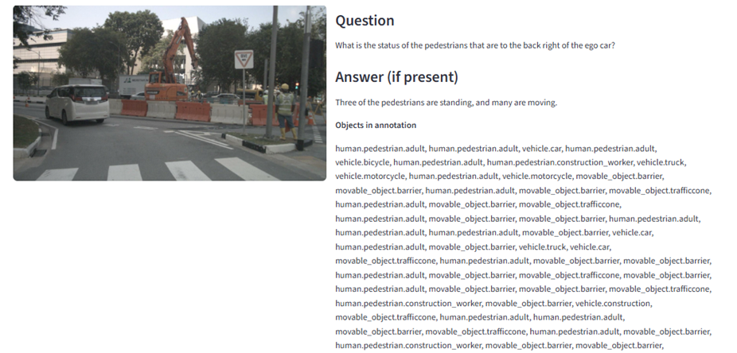

#### Identifying Patterns & Anomalies

                            Findings (Patterns & Anomalies)

#### Question type distribution

chart path :output_dist\question_types.png

•	Object Location questions dominate by a large margin — far more than Vehicle Behaviours or Object Interaction.
•	Pattern: The dataset has a strong emphasis on localization (where things are relative to ego).
•	Implication/bias: Models trained on this dataset may become strong at localization tasks but weak on interaction reasoning (because Object Interaction is rare).
•	Possible anomaly to check: Are some interaction questions omitted or mis-labeled as "Other" or "Object Location"?

#### Object category distribution

chart path: output_dist\object_categories.png

•	Pedestrians and cars are the most common categories (these two categories far outnumber others).
•	Some object types (motorcycle, trailer, bicycle, truck, police officer) are very underrepresented.
•	Pattern: The dataset has a strong urban driving focus with pedestrians and cars; other road actors are sparse.
•	Implication/bias: The model will generalize poorly to rare classes (motorcycles, trailers, emergency vehicles).
•	A non-trivial count for movable_object.debris / movable_object.barrier (if present) suggests some samples contain obstacles—this is good, but still likely less frequent than cars/pedestrians.
•	Action: Calculate per-class frequency and set a threshold (e.g., <1% of all objects) to define "rare classes."

#### Object attribute distribution
 chart path: output_dist\object_attributes.png

•	Moving pedestrians is the single biggest attribute group; vehicle moving/parked/stopped are well represented too.
•	Pattern: Many dynamic object states are present (moving vs parked vs stopped).
•	Implication: The dataset will likely teach models better on dynamic state detection for pedestrians and cars, but cycling states are rare (cycle_with_rider, cycle_without_rider are small).
•	Action: Check the co-occurrence of attributes and classes (e.g., how many pedestrian.moving co-occur with object interaction questions).

##### High-level anomalies & checks
•	Underrepresentation of Object Interaction relative to object counts—many annotated objects but few interaction questions. Investigate why:
•	Are interaction questions not generated?
•	Are interactions labeled as other types?
•	Scene imbalance risk: Verify if few scenes contribute a disproportionate number of questions/annotations (scene-level long-tail).
•	Missing data issues to check: Samples with num_lidar_pts == 0 or num_radar_pts == 0 may indicate occluded or potentially noisy annotations. Check image existence for all _linked_sample_data.filename.
•	Temporal imbalance: Check timestamps to ensure data is not heavily concentrated in a few time periods.

#### Challenging sample questions, showing the corresponding image and relevant metadata. 

	
 

