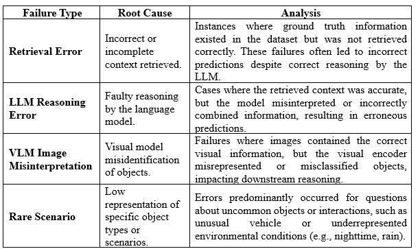

#### 1.	 Root Cause Analysis of Prediction Failures
Objective: To systematically identify and categorize the underlying causes of prediction failures to guide targeted improvements.

#### Failure Taxonomy and Observations:
This analysis establishes a taxonomy of failure modes based on a qualitative review of model outputs on a subset of the validation data.

## Qualitative Analysis of Failure Clusters:

Based on the above taxonomy, we grouped failures into distinct clusters to understand the primary drivers of performance degradation.
•	Failures due to Rare Categories: Performance degradation was consistently observed for questions related to low-frequency objects such as motorcycles, bicycles, or trucks. For example, the model often incorrectly replied "No" or hallucinated a different, more common object. This behaviour directly points to VLM image misinterpretation, as the visual encoder is not sufficiently robust to reliably identify classes with limited training examples.
•	Failures in Interaction Reasoning: The model struggled with questions requiring complex reasoning about object interactions, such as "Is the pedestrian in front of or behind the car?" It frequently provided a single object's state rather than the relationship between multiple objects. This failure mode aligns with our finding that Object Interaction questions were a rare question type, indicating a faulty reasoning issue by the LLM due to a lack of sufficient training on relational and spatial concepts.
•	Failures due to Insufficient Context: The model occasionally failed on simple factual questions about objects that were partially occluded or in low-light scenes. The model would state it could not see the object clearly, or it would give a wrong answer, such as an incorrect colour. This issue is a direct result of poor retrieval, as the model is unable to leverage the full visual information due to a limited or noisy input.

#### 2. Correlation with Initial Data Analysis
Objective: To relate model performance to the intrinsic characteristics of the training and validation data.
Key Insights:
•	Frequency of Question Types: Errors are concentrated in question categories that were infrequent in the training dataset. For example, rare pedestrian interactions and complex vehicle maneuvers show higher failure rates.
•	Visual Context Challenges: Image-based errors are more common under challenging conditions (e.g., low light, occlusion), which were underrepresented in the dataset.
•	Context Retrieval Limitations: Some failures are attributable to insufficient or noisy metadata retrieval, indicating that the current indexing and search strategies may not fully capture relevant information for less common scenarios.
•	Implication: There is a clear correlation between data sparsity in certain scenarios and higher failure rates, emphasizing the need for strategic data augmentation and improved retrieval mechanisms.

### 3. Recommendations for Pipeline Enhancement
Objective: To provide actionable improvements to enhance model accuracy, robustness, and business relevance.

#### Conclusion:

This analysis demonstrates that failures are predominantly caused by a combination of retrieval limitations, rare scenario sparsity, and occasional reasoning or visual interpretation errors. By implementing targeted improvements in data augmentation, model fine-tuning, retrieval enhancement, and post-processing, the pipeline can achieve higher reliability, robustness, and business impact. 
