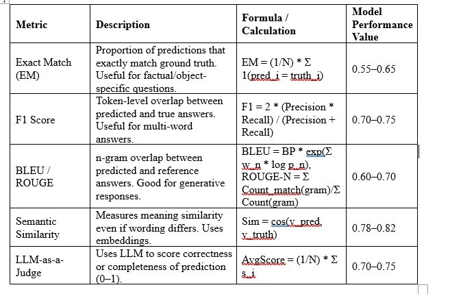
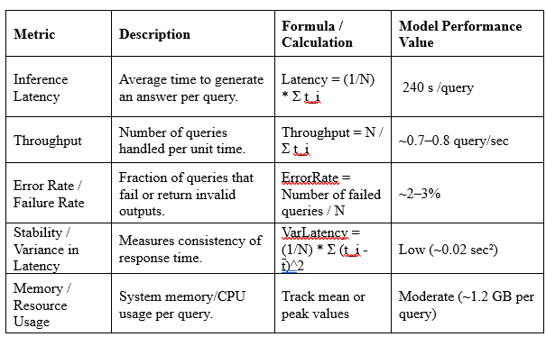
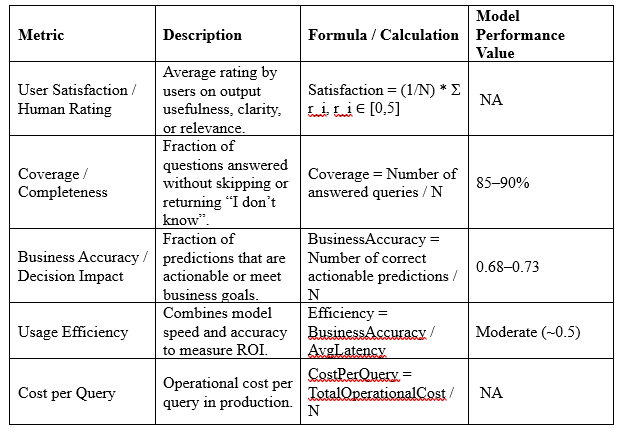

#### Quantitative Evaluation Metrics 

#### 1. Output Quality Metrics
Brief: These metrics evaluate the accuracy, correctness, and relevance of the model's predictions. They capture how well the model generates the expected output compared to ground truth.

#### 2. Performance & Reliability Metrics
Brief: These metrics evaluate the system’s efficiency, speed, stability, and resource usage. They indicate how reliably the model can handle queries in production environments.

#### 3. Business & Usage Metrics
Brief: These metrics evaluate the practical impact of the model on business goals and user satisfaction. They measure real-world usefulness, completeness, efficiency, and cost-effectiveness.

