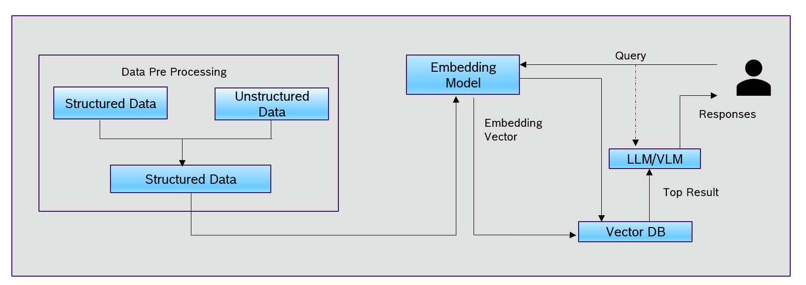

### 🔑 Steps to run the Project:

1. To run the complete streamlit application
      streamlit run drivelm_streamlit.
      
Additional Runs:      

Please add "sweeps" folder in data/nuscenes. Link: https://www.nuscenes.org/nuscenes .Please use the NuScenes-mini split (v1.0). 

1. To preapare the dataset:
      python scrpit/prepare_datset.py 
2. To run the analysis:
      python scrpit/analysis.py 

### 🎨 Solution Architecture Diagram:

### 🎨 Data Analysis charts are present in:
      output_dist folder

### 🎨 Analysis_evalution_execution_docu
     Data_Analysis_Findings: This document contains data analysis findings.
     Q3_Quantitative_Evaluation: This document conatins Quantitative Evaluation.
     Q3_Qualitative Evaluation and Improvements: This document conatins Qualitative Evaluation and improvements.
     Images_of_project_execution: This document contains images of project execution.

### Docker Image
1. Run the commands
    docker pull seenaelizeebthmathew/drive-lm-analysis:latest
    docker run -p 8501:8501 seenaelizeebthmathew/drive-lm-analysis:latest   
      
2. access the application via  http://localhost:8501           